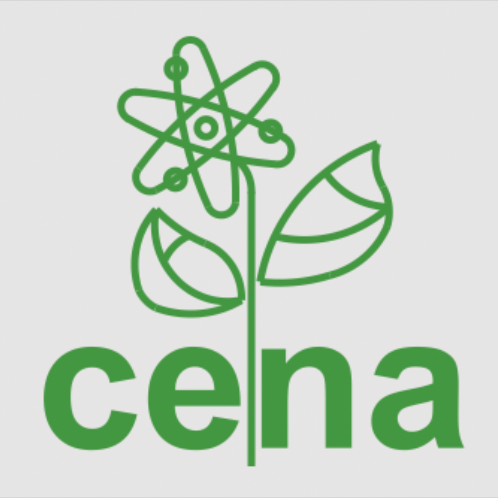
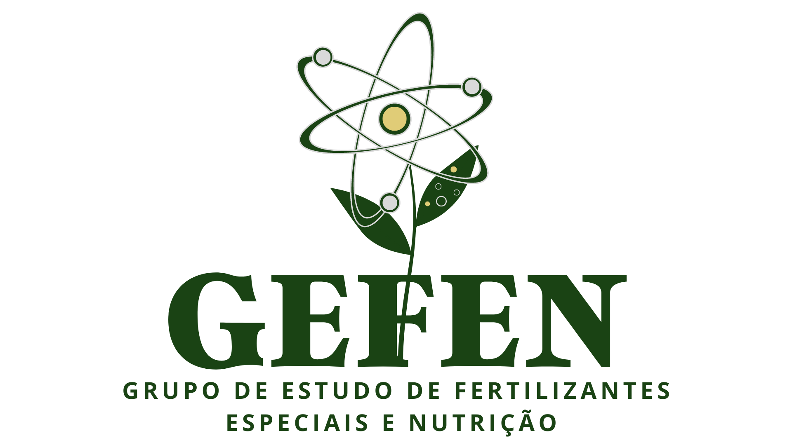
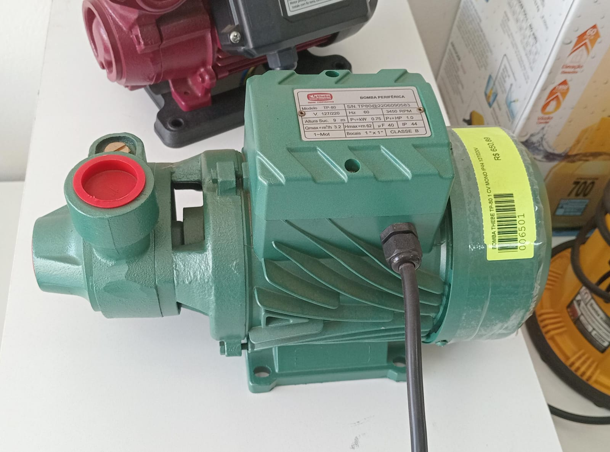
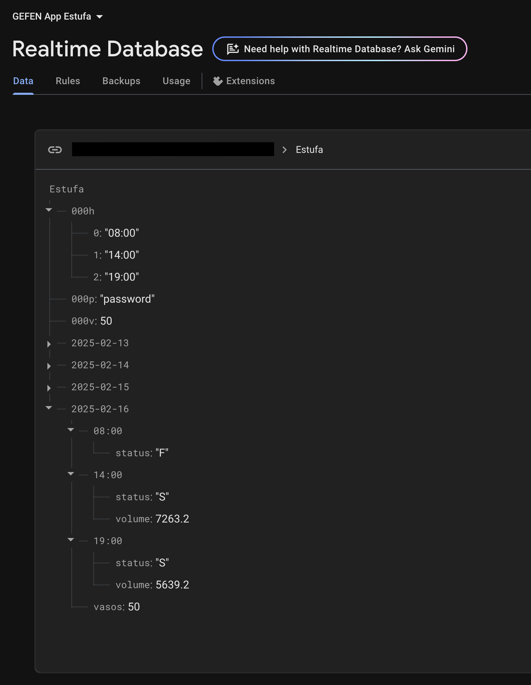
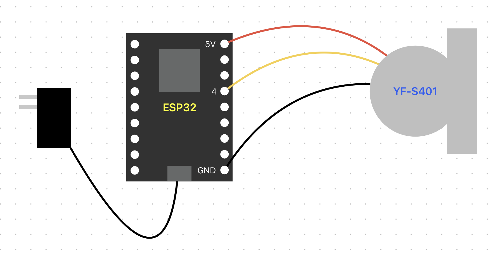
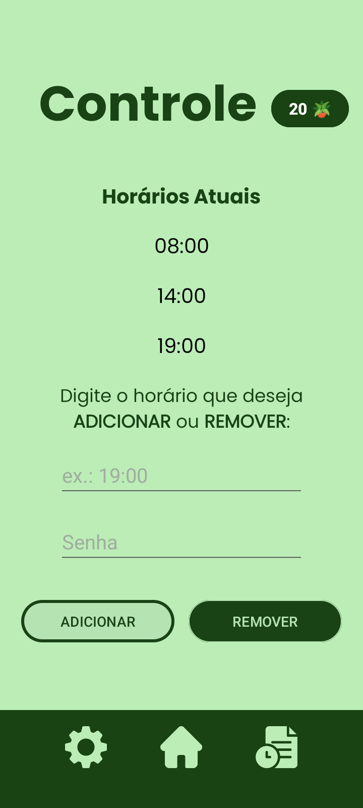
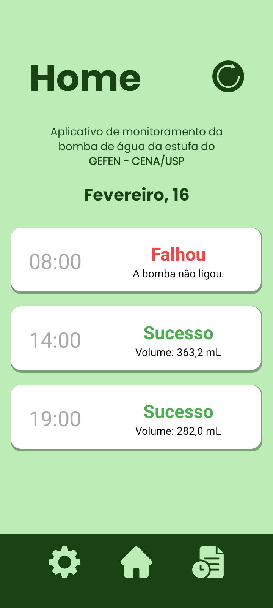
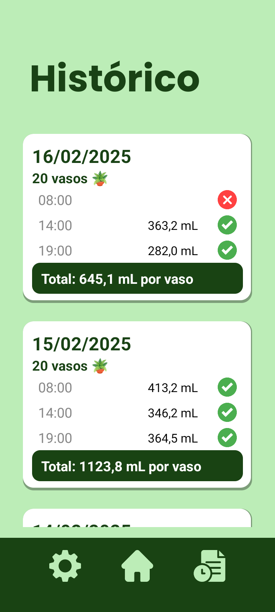

# IoT-Greenhouse

Este repositório contém a minha implementação de um sistema de monitoramento de irrigação de uma estufa através de um aplicativo de celular, utilizando ESP32. 

Este projeto foi um pedido de um amigo, a fim de monitorar a rega de plantas na estufa.

## GEFEN - CENA/USP
Meu amigo Gustavo é estudante de Engenharia Agronômica pela ESALQ (Escola Superior de Agricultura Luiz de Queiroz), em Piracicaba, São Paulo. 

<p align="center">
  
</p>
<p align="center">
  <a style="font-size: 12px; text-decoration: none; color: inherit;">
    Prédio principal da ESALQ.
  </a>
</p>

Além de ser estudante de graduação, ele é membro e pesquisador do GEFEN (Grupo de Estudos em Fertilizantes Especiais e Nutrição) do CENA (Centro de Energia Nuclear na Agricultura). Ambos os Institutos pertencem à ```USP```, a gloriosa Universidade de São Paulo. 

<table align="center">
  <tr>
    <td align="center">
      <br>
      <a href="https://www.linkedin.com/company/centro-de-energia-nuclear-na-agricultura---cena-usp/" style="font-size: 12px; text-decoration: none; color: inherit;">
        <u>CENA - USP</u>
      </a>
    </td>
    <td align="center">
      <br>
      <a href="https://www.linkedin.com/in/gefen-usp/" style="font-size: 12px; text-decoration: none; color: inherit;">
        <u>GEFEN</u>
      </a>
    </td>
  </tr>
</table>

O CENA possui uma estufa, fundada em 1962 e que foi tombada como patrimônio histórico da USP. Essa estufa é utilizada pelo GEFEN, para a realização de diversos experimentos em diferentes plantas.

<p align="center">
  
</p>
<p align="center">
  <a style="font-size: 12px; text-decoration: none; color: inherit;">
    Estufa do CENA.
  </a>
</p>


## Ilustrando o problema
A fim de automatizar o processo de irrigação, o GEFEN comprou uma bomba de água e desenvolveu um sistema de irrigação automático com um timer. Este timer foi configurado para ligar a bomba algumas vezes ao dia, impulsionando a água através de um tubo gotejador, assim regando as plantas automaticamente.

<table align="center">
  <tr>
    <td align="center">
      <br>
      <a style="font-size: 12px; text-decoration: none; color: inherit;">
        Bomba de água.
      </a>
    </td>
    <td align="center">
      <br>
      <a style="font-size: 12px; text-decoration: none; color: inherit;">
        Tubo gotejador.
      </a>
    </td>
  </tr>
</table>

Foi aí que meu amigo Gus entrou em contato comigo. Ele relatou que por vezes esse sistema falha, ou porque o timer falhou inesperadamente ou porque entrou ar no sistema da bomba e nenhuma água foi bombeada, assim compromentendo o experimento e podendo levar a morte das plantas. 

Ele me pediu para desenvolver uma solução, que através de um aplicativo de celular, avisasse se a bomba funcionou ou não. Com isso, caso o sistema da bomba falhasse, ele seria avisado e o experimento seria salvo. Então essa foi a hora de colocar meus conhecimentos em prática... ou não. 

## Visão geral da solução
É importante ressaltar que eu nunca havia feito um projeto grande como esse antes. Muito do que eu utilizei no projeto eu não aprendi explicitamente na faculdade, acabei descobrindo através de pesquisa de projetos semelhantes.

O sistema embarcado constitui-se de uma ```ESP32``` conectada a um sensor de fluxo de água YF-S201. Três vezes ao dia, durante o horário suposto de funcionamento da bomba, a ESP32 liga e começa a escutar dados do sensor. Todos os códigos da ESP32 foram desenvolvidos em linguagem C++.

O aplicativo foi desenvolvido no ```Android Studio```, na linguagem ```Kotlin```. O app constitui-se de apenas três telas simples, sendo elas:
- Uma home, para visualizar as irrigações do dia de hoje;
- Um histórico, para visualizar as irrigações dos dias anteriores;
- Uma página de configurações, para alterar os horários de irrigação.

A integração do app com o sistema embarcado foi feito através do ```Firebase``` do Google. Ele é uma solução gratuita de servidor e de banco de dados em tempo real desenvolvido pelo Google.

imagem ilustração do sistema

# O Servidor
O servidor é o que une as duas pontas do sistema, e é hospedado pelo Firebase do Google, que oferece uma série de ferramentas. No caso, estou utilizando uma base de dados em tempo real, para armazenar as informações das irrigações. No caso, trata-se de uma base de dados não relacional, ideal para esse tipo de aplicação simples. As informações das chaves 000 são uma espécie de cabeçalho utilizada pela aplicação. Os dados guardados pelas chaves no formato de data dizem respeito ao sucesso ou fracasso das irrigações, além do volume total de escoado de cada uma. 

<p align="center">
  
</p>
<p align="center">
  <a style="font-size: 12px; text-decoration: none; color: inherit;">
    Base de dados da aplicação.
  </a>
</p>

Todas as funcionalidades foram implementadas de forma que o usuário, no caso, meu amigo Gus, tenha extrema facilidade para adicionar e remover os horários de irrigação. Por isso, toda a comunicação é intermediada pelo servidor. Sempre que o ESP liga, por exemplo, ele se conecta à Base de Dados para saber quais são os horários que ela deve funcionar. 

# O Sistema Embarcado
O sistema físico consiste em um ESP32 alimentado por uma fonte DC chaveada de 5V, ligada diretamente na tomada 110V da estufa. Ligado no 5V do ESP, o sensor de fluxo ```YF-S401``` mede através de uma saída de pulsos digitais a quantidade a vazão de água, e por sua vez, código no firmware do ESP calcula o volume total escoado. Ao final da medição, o ESP publica na base de dados todas as informações pertinentes a irrigação, e entra em modo de Deep-Sleep até a próxima.

<p align="center">
  
</p>
<p align="center">
  <a style="font-size: 12px; text-decoration: none; color: inherit;">
    Esquema do Circuito.
  </a>
</p>

# O Aplicativo
Na Home do App, é possível ver as informações sobre as irrigações do dia atual. Na aba de Histórico, é possível visualizar dados de vazão e de sucesso ou fracasso dos dias anteriores, além da quantidade de vasos presentes em cada dia de experimento. Na aba Controle, o usuário pode alterar os horários de irrigação, além de alterar a quantidade de vasos do dia atual de experimento. Para editar os horários, é necessário saber a senha definida pelo administrador.


<table align="center">
  <tr>
    <td align="center">
      <br>
      <a style="font-size: 12px; text-decoration: none; color: inherit;">
        Aba Controle do aplicativo.
      </a>
    </td>
    <td align="center">
      <br>
      <a style="font-size: 12px; text-decoration: none; color: inherit;">
        Aba Home do aplicativo.
      </a>
    </td>
    <td align="center">
      <br>
      <a style="font-size: 12px; text-decoration: none; color: inherit;">
        Aba Histórico do aplicativo.
      </a>
    </td>
  </tr>
</table>


